# ParkIt: AI-Powered Smart Parking Assistant for Motorcycles
> **Adaptive Spatial-Gap Based Parking Slot Classification using YOLOv12 and Monocular CCTV Feeds**

---

### Tech Stack
* **Mobile Frontend:** Flutter (Dart) using GetX State Management
* **Backend API:** FastAPI (Python)
* **Deep Learning Model:** YOLOv12 + Adaptive Spatial-Gap Classification (ASB-PSC)
* **Database:** MongoDB
* **Tunneling/Deployment:** Cloudflare Tunnel / Ngrok

---

## 📌 Project Overview
**ParkIt** is an intelligent, real-time motorcycle parking slot detection system designed for dynamic and unstructured parking areas (such as the campus motorcycle parking facilities at Universitas Pembangunan Jaya). Traditional parking systems rely on physical sensors or static bounding boxes (Region of Interest) that require manual configuration and fail when camera views shift. 

ParkIt solves this using a computer-vision-based approach:
1. **YOLOv12 Object Detection:** Detects motorcycles and boundaries dynamically from monocular CCTV camera feeds.
2. **Adaptive Spatial-Gap Based Parking Slot Classification (ASB-PSC):** Instead of checking predefined slots, the system calculates the real-time distance (using Euclidean distance on bounding box coordinates) between detected vehicles and row boundaries.
3. **Dimension-Aware Matching:** The mobile app matches the detected empty gaps with the registered physical dimensions of the user's motorcycle (plus a 15–20 cm spatial buffer) to recommend slots that can physically fit their vehicle.

This repository hosts the **Flutter Mobile Application** codebase, which serves as the user interface for riders to register vehicles, view real-time slot occupancy, inspect live annotated CCTV feeds, and manage active parking sessions.

The FastAPI backend and AI inference engine are hosted in a separate repository:
🔗 **Backend Repository:** [atilanaufal/ParkIt-Backend](https://github.com/atilanaufal/ParkIt-Backend)

---

## 📱 Mobile App UI Showcase
Below is a gallery of the user interface screenshots showing the flow and features of the ParkIt mobile app:

### 1. Vehicle Registration & Setup
Riders register their motorcycles with specific dimensions. The physical width is used by the ASB-PSC algorithm to recommend vacant slots that are suitable for their specific vehicle type.

| Register Vehicle | User Profile & Bike Details |
| --- | --- |
| 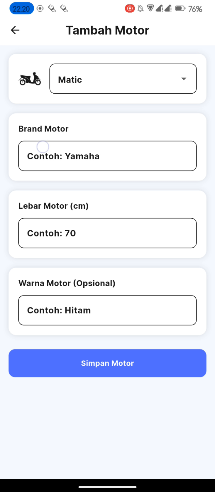 | 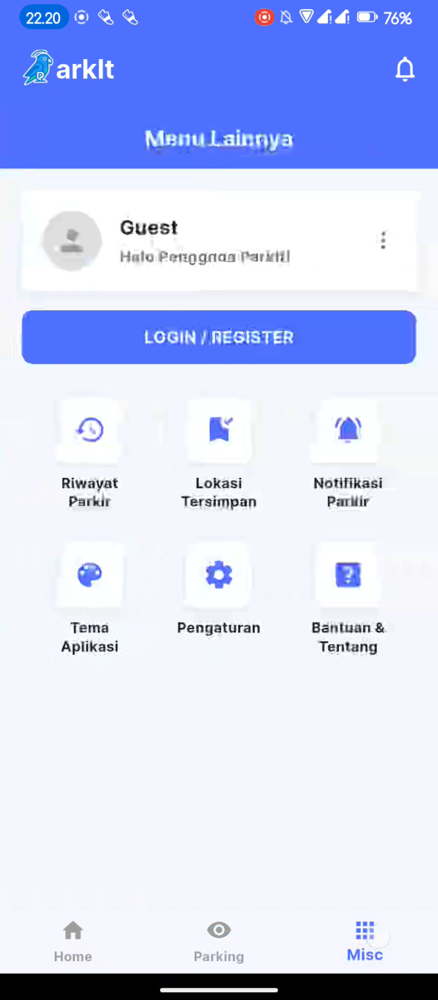 |

### 2. Main Dashboard (Beranda)
The home dashboard changes dynamically depending on user activity.

| No Active Session | Registered Motorcycle View | Active Parking Session |
| --- | --- | --- |
| 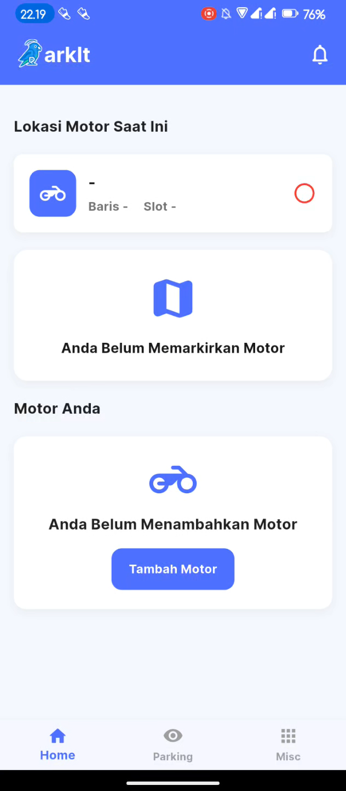 | 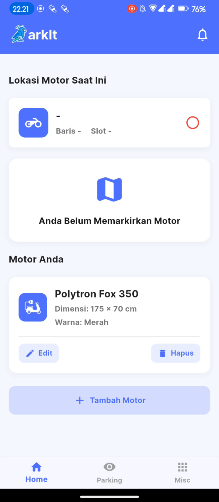 | 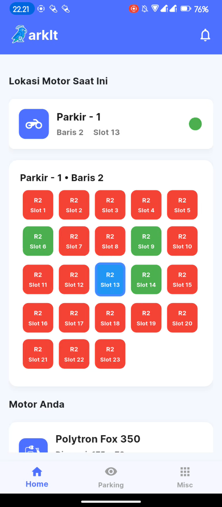 |

### 3. Slot Occupancy Status & Recommendations
Riders can inspect available slots categorized by layout (e.g. Row 1, Row 2) with status indicators (occupied, empty, almost full) and check in to a slot.

| Parking Slot Status | Recommended Slots List |
| --- | --- |
| 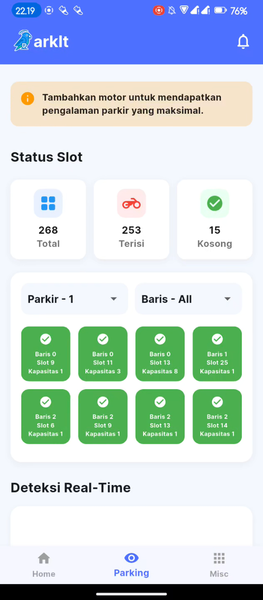 | 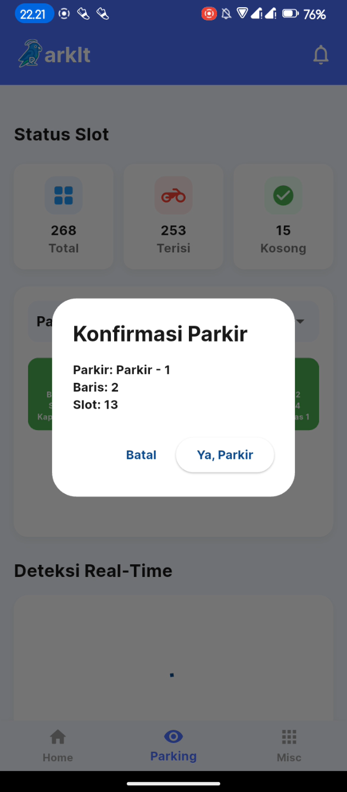 |

### 4. Interactive Live Annotated CCTV Feed
Riders can watch live annotated camera feeds that highlight detected motorcycles and available spatial gaps/slots.

| Live CCTV Feed | Zoomed View |
| --- | --- |
| 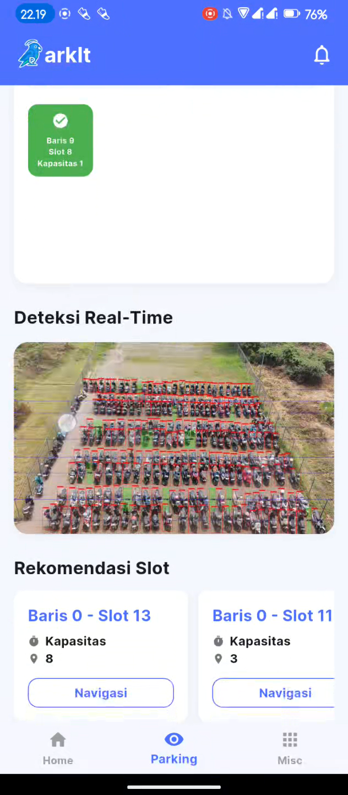 | 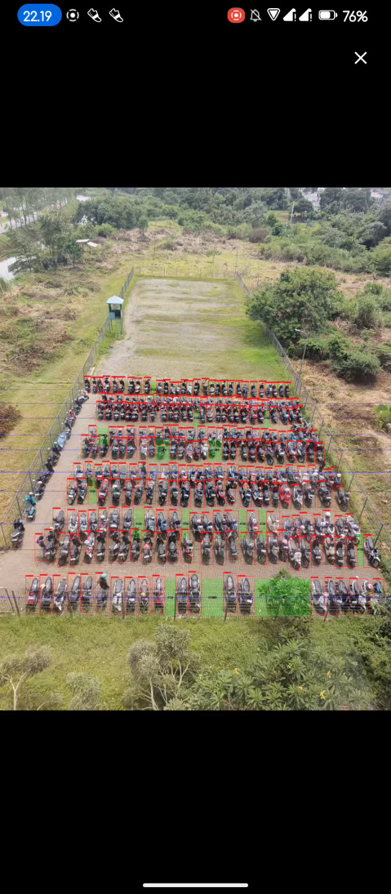 |

### 5. Session Control
Riders can easily change their parking slot manually or end the active session when leaving the parking space.

| Change Parking Slot | End Parking Session |
| --- | --- |
| 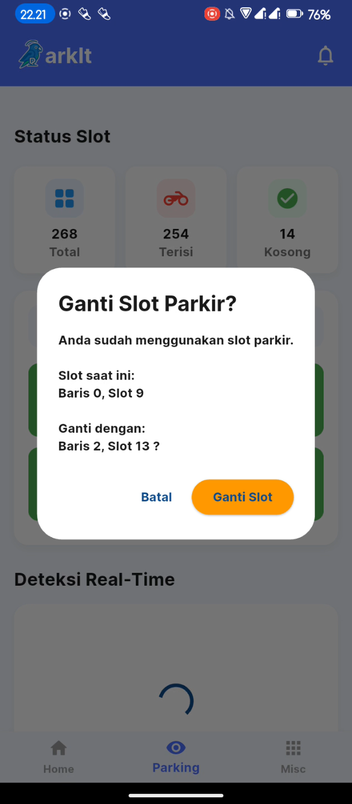 | 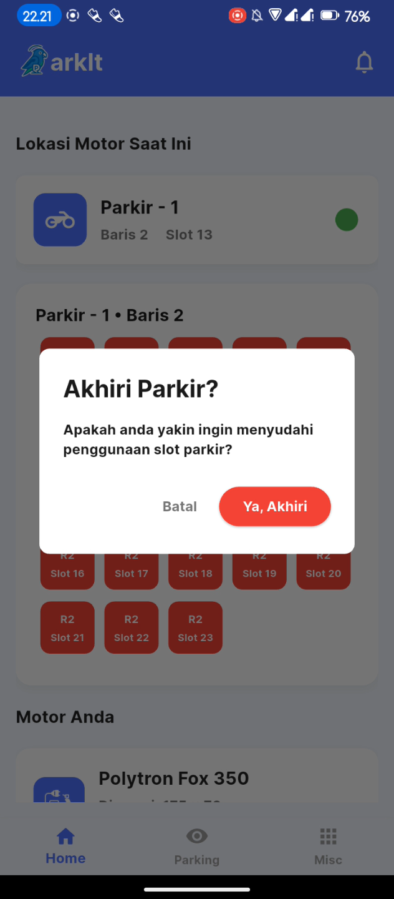 |

---

## 🛠️ Installation & Running Guide

### Prerequisites
Make sure your development environment satisfies the following:
* **Flutter SDK:** version `^3.9.2` or later (which includes Dart SDK `^3.9.2`)
* **Android Studio** (for Android Emulator/SDK tools) or **Xcode** (for iOS Simulator, macOS only)
* **Git** installed on your machine

### Step 1: Clone the Repository
```bash
git clone https://github.com/atilanaufal/Parkit-Smart-Parking-Assistant.git
cd Parkit-Smart-Parking-Assistant
```

### Step 2: Install Flutter Dependencies
Run the package installation command to fetch all required libraries (e.g., GetX, http, and custom fonts):
```bash
flutter pub get
```

### Step 3: Configure Backend API Endpoints
The mobile app communicates with the FastAPI backend. You must configure the server's endpoint address in the following service files:

1. **`lib/services/motor_service.dart`** (around line 6):
   ```dart
   static const String _baseUrl = 'YOUR_BACKEND_URL_HERE';
   ```
2. **`lib/services/parking_service.dart`** (around line 6):
   ```dart
   static const String baseUrl = 'YOUR_BACKEND_URL_HERE';
   ```
3. **`lib/services/user_service.dart`** (around line 5):
   ```dart
   static const String _baseUrl = 'YOUR_BACKEND_URL_HERE';
   ```

> ⚠️ **Configuration Note:** 
> * If running on a local development network, use your machine's local IP address (e.g. `http://192.168.1.X:8000`) or the Android emulator host loopback IP (`http://10.0.2.2:8000`). 
> * If the backend is exposed via Ngrok or Cloudflare Tunnel, use the public HTTPS URL (e.g., `https://xxxx.trycloudflare.com`).

### Step 4: Run the Application
Start the development server and run the app on a connected physical device or emulator:
```bash
flutter run
```

To build production release files:
```bash
# For Android APK production build
flutter build apk --release

# For iOS production build
flutter build ios --release
```

---

## 🧠 System Architecture & API Endpoints

### Data Flow
1. **IP Camera/CCTV** uploads or streams frames to the FastAPI Backend.
2. The Backend runs the **YOLOv12** detector and processes bounding boxes through the **ASB-PSC** gap calculation model.
3. Calculated results are stored in **MongoDB** and broadcast via REST APIs (and WebSockets for real-time sync).
4. The **ParkIt Flutter Client** fetches availability statistics and renders the live-annotated image.

### API Services In Use
The mobile application consumes the following key REST API endpoints from the backend server:
* `GET /api/results/latest`: Fetches the latest system occupancy results.
* `GET /api/results/{session_id}/image`: Retrieves the annotated CCTV frame with bounding boxes.
* `POST /api/users/register`: Registers a new mobile app user.
* `POST /api/motorcycles/register`: Saves user motorcycle configurations (dimensions, model, color).
* `GET /api/motorcycles/user/{userId}`: Retrieves registered motorcycles associated with a user ID.

---

## 📈 System Performance Metrics
Based on the project's deep learning evaluations:
* **Object Detection Model:** YOLOv12m (20.14M parameters)
* **Detection Accuracy (mAP@0.5):** **95.3%**
* **Precision:** **92.9%** (Very low false-positive rate)
* **Recall:** **85.3%** (Highly reliable motorcycle detection)
* **Inference Speed:** **~77ms / frame** (equivalent to ~13 FPS on an NVIDIA Tesla T4 GPU)
* **API Response Latency:** **52ms (average)** under load testing

---
